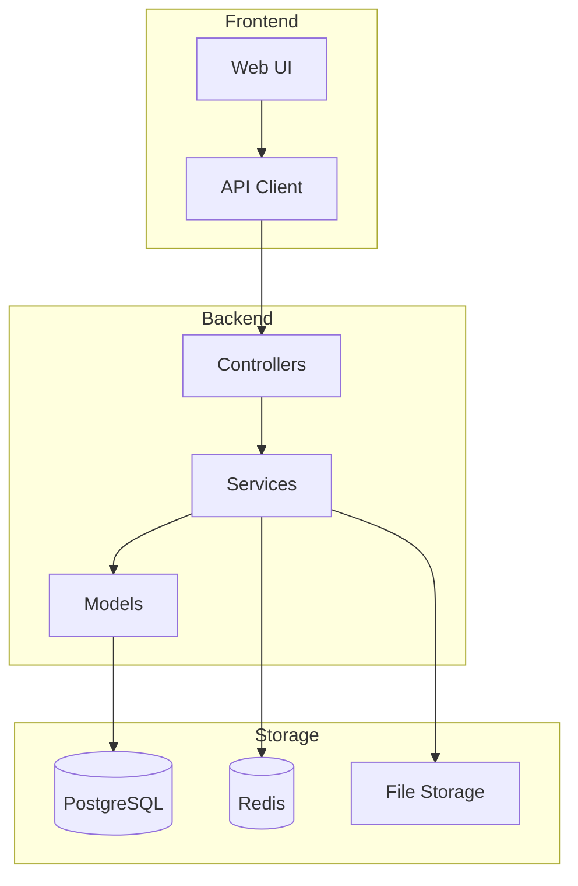
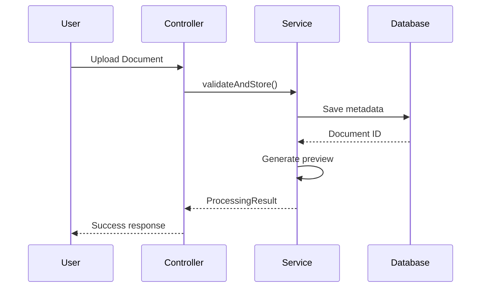
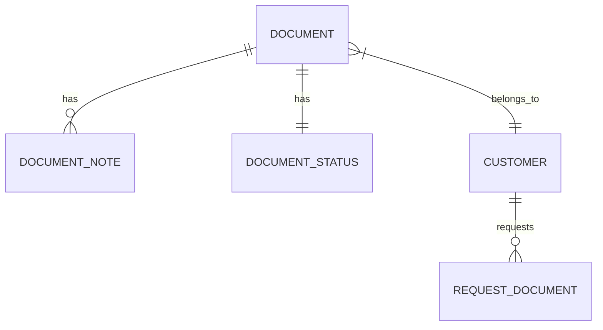

# Architecture Documentation Guide

## Mermaid Diagrams

### System Architecture



### Sequence Diagrams



### Entity Relationships



## Module Documentation Template

```markdown
# [Module Name]

## Overview
Brief description of the module's purpose.

## Components

### Models
- `Document` - Core document entity
- `DocumentStatus` - Status tracking

### Services
- `DocumentService` - Business logic
- `ValidationService` - Document validation

### Controllers
- `DocumentController` - API endpoints
- `AdminDocumentController` - Admin operations

## Data Flow

[Mermaid diagram here]

## Configuration

| Key | Type | Default | Description |
|-----|------|---------|-------------|
| `documents.max_size` | int | 10MB | Maximum file size |

## Events

| Event | When | Payload |
|-------|------|---------|
| `DocumentUploaded` | After upload | `Document $document` |

## Dependencies
- `spatie/laravel-medialibrary` for file storage
- `intervention/image` for thumbnails
```

## File Structure Documentation

```markdown
## Directory Structure

```
app/
├── Http/
│   └── Controllers/
│       └── Documents/           # Document-related controllers
├── Models/
│   └── Document/               # Document models
├── Services/
│   └── Documents/              # Document business logic
└── Events/
    └── Document/               # Document events
```
```
