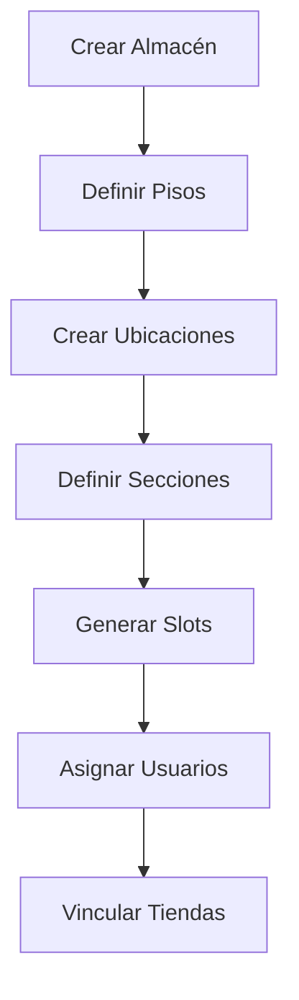
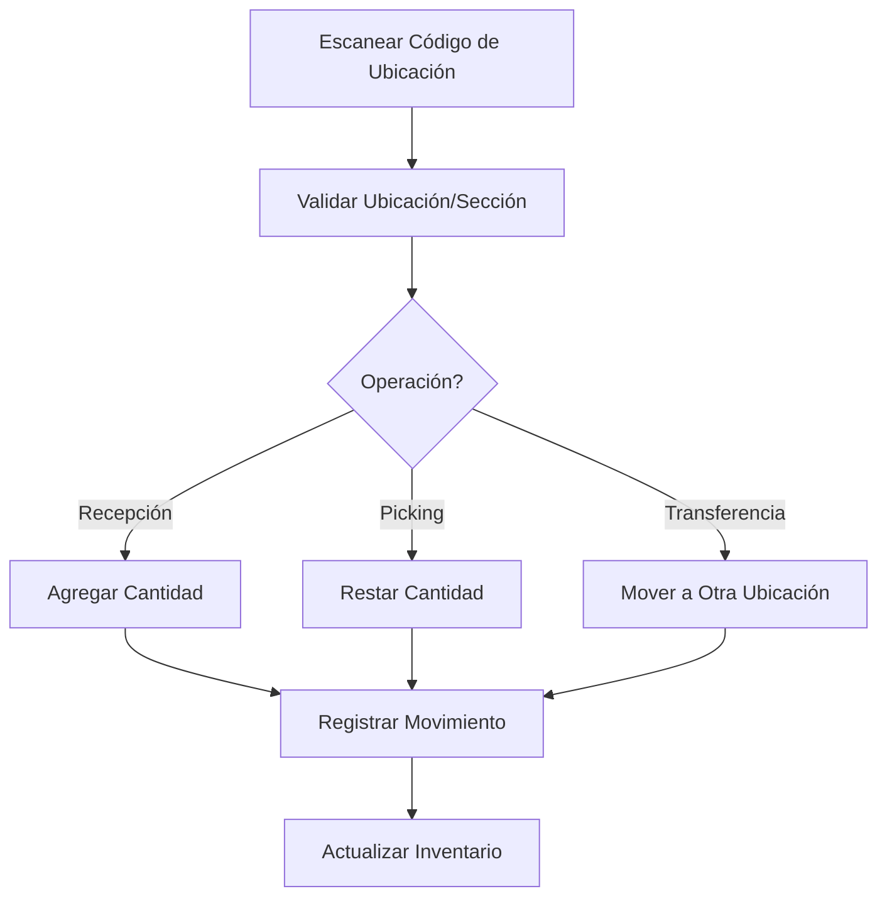
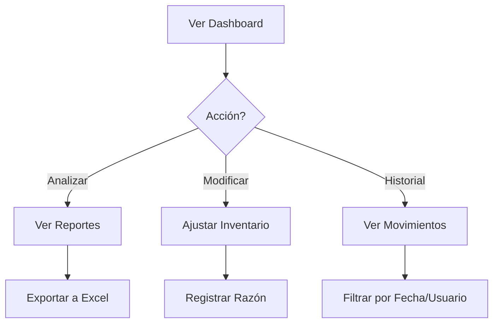

# Módulo Warehouse - Documentación General

## Descripción General

El módulo **Warehouse** es un sistema completo de gestión de almacenes (WMS - Warehouse Management System) de nivel empresarial integrado en la aplicación Alsernet. Proporciona capacidades avanzadas de seguimiento de inventario, gestión de ubicaciones, y control de movimientos con auditoría completa.

## Ubicación del Módulo

```
modules/Warehouse/
```

## Características Principales

### 1. Gestión Multi-Almacén
- Soporte para múltiples almacenes/instalaciones
- Organización jerárquica por pisos/niveles
- Asignación de usuarios a almacenes específicos
- Vinculación de tiendas a almacenes

### 2. Seguimiento de Inventario a Nivel de Posición
- Jerarquía de 5 niveles: Almacén → Piso → Ubicación → Sección → Slot
- Seguimiento preciso hasta la posición física exacta
- Capacidad de peso y cantidad por sección
- Estados de ocupación en tiempo real

### 3. Registro de Auditoría Completo
- Historial completo de todos los movimientos de inventario
- Atribución de usuario para cada operación
- Tipos de movimiento: agregar, restar, mover, limpiar, contar
- Razones y notas para cada movimiento

### 4. Planificación Visual de Almacenes
- Editor interactivo de diseño de piso
- Sistema de arrastrar y soltar para ubicaciones
- Parser de layouts complejos en JavaScript
- Generación masiva de ubicaciones desde especificaciones

### 5. Integración de Códigos de Barras
- Generación de códigos QR para ubicaciones
- Códigos de barras para productos
- Interfaz de escaneo para workers
- Impresión masiva de etiquetas

### 6. Sistema de Permisos Granular
- Control de acceso basado en roles (RBAC)
- Permisos específicos por almacén
- Capacidades individuales (transferir, inventariar)
- Políticas de autorización por entidad

### 7. Reportes y Analíticas
- Reporte de inventario actual
- Reporte de movimientos históricos
- Análisis de ocupación y capacidad
- Estadísticas por piso y ubicación

### 8. Operaciones de Transferencia
- Mover productos entre ubicaciones
- Transferencias parciales de cantidad
- Validación de disponibilidad
- Registro automático de movimientos

## Arquitectura del Módulo

### Estructura de Directorios

```
modules/Warehouse/
├── app/
│   ├── Console/
│   │   └── Commands/              # Comandos Artisan personalizados
│   ├── Entities/                  # Alias de Models/ (15 modelos)
│   ├── Exports/
│   │   └── Managers/              # Clases de exportación Excel
│   ├── Http/
│   │   ├── Controllers/
│   │   │   ├── Settings/          # Controladores de Manager (20+)
│   │   │   ├── Locations/         # Controladores de Worker
│   │   │   ├── Products/          # Gestión de productos
│   │   │   └── DashboardController.php
│   │   ├── Requests/              # Validación de formularios
│   │   └── ViewComposers/         # Compositores de vista
│   ├── Models/                    # 15 modelos Eloquent
│   ├── Policies/                  # 6 políticas de autorización
│   ├── Providers/
│   │   └── WarehouseServiceProvider.php
│   ├── Services/
│   │   └── WarehouseLayoutParser.php
│   └── Traits/                    # Traits compartidos
├── config/
│   └── warehouse.php              # Configuración del módulo
├── database/
│   ├── migrations/                # 12 migraciones
│   └── seeders/                   # 14 seeders
├── resources/
│   ├── lang/                      # Traducciones
│   └── views/                     # 95+ plantillas Blade
│       ├── dashboard/             # Dashboards de worker
│       ├── settings/              # Vistas de manager
│       └── warehouses/            # Vistas operativas
├── routes/
│   ├── web.php                    # Rutas de manager
│   ├── warehouses.php             # Rutas de worker
│   └── api.php                    # API (futuro)
└── tests/                         # Tests unitarios y de feature
```

### Modelos y Entidades (15 total)

| Modelo | Propósito | Relaciones Clave |
|--------|-----------|------------------|
| **Warehouse** | Almacén principal | hasMany(Floors, Locations), belongsToMany(Users, Shops) |
| **WarehouseFloor** | Piso/nivel del almacén | belongsTo(Warehouse), hasMany(Locations) |
| **WarehouseLocation** | Estantería/ubicación | belongsTo(Floor), hasMany(Sections) |
| **WarehouseLocationStyle** | Estilo visual de ubicación | hasMany(Locations) |
| **WarehouseLocationCondition** | Condiciones ambientales | N/A (plantillas) |
| **WarehouseLocationSection** | Cara/sección de estantería | belongsTo(Location), hasMany(Slots) |
| **WarehouseInventorySlot** | Posición individual de inventario | belongsTo(Section, Product), hasMany(Movements) |
| **WarehouseInventoryMovement** | Registro de movimiento | belongsTo(Slot, User) |
| **WarehouseInventoryOperation** | Operación masiva | hasMany(OperationItems) |
| **WarehouseOperationItem** | Ítem de operación | belongsTo(Operation) |
| **WarehouseUser** | Pivote usuario-almacén | Tabla pivote con permisos |
| **WarehouseShop** | Pivote tienda-almacén | Tabla pivote |
| **Product** | Producto del catálogo | hasMany(InventorySlots) |
| **ProductLocation** | Mapeo producto-ubicación | Tabla de referencia cruzada |
| **Kardex** | Libro mayor de inventario | Sistema de contabilidad de stock |

### Controladores (26+ archivos)

**Controladores de Manager** (`app/Http/Controllers/Settings/`):
- `WarehouseController` - CRUD de almacenes
- `WarehouseDashboardController` - Dashboard con analíticas
- `WarehouseMapController` - Editor visual de plano
- `WarehouseFloorsController` - Gestión de pisos
- `WarehouseLocationsController` - Gestión de ubicaciones
- `WarehouseLocationSectionsController` - Gestión de secciones
- `WarehouseLocationStylesController` - Estilos de ubicación
- `WarehouseInventorySlotsController` - Gestión de slots
- `WarehouseHistoryController` - Historial de movimientos
- `WarehouseReportsController` - Generación de reportes
- `ShopsController` - Vinculación de tiendas
- `ProductsController` - Gestión de productos

**Controladores de Worker** (`app/Http/Controllers/`):
- `WarehousesController` - Dashboard operativo
- `LocationsController` - Operaciones de ubicación
- `TransferController` - Transferencias de inventario
- `BarcodeController` - Escaneo de códigos

### Servicios

**WarehouseLayoutParser** (`app/Services/WarehouseLayoutParser.php`):
- Parsea especificaciones de layout en JavaScript
- Convierte definiciones visuales en registros de base de datos
- Soporta posicionamiento complejo (anclajes, dependencias fromPrev)
- Valida y reporta errores/advertencias
- Genera resúmenes de pisos, ubicaciones y secciones

### Políticas de Autorización (6 archivos)

```php
app/Policies/
├── WarehousePolicy.php                      # Autorización de almacenes
├── WarehouseFloorPolicy.php                 # Autorización de pisos
├── WarehouseLocationPolicy.php              # Autorización de ubicaciones
├── WarehouseInventorySlotPolicy.php         # Autorización de slots
├── WarehouseInventoryOperationPolicy.php    # Autorización de operaciones
└── WarehouseLocationStylePolicy.php         # Autorización de estilos
```

Cada política implementa métodos estándar: `viewAny`, `view`, `create`, `update`, `delete`

## Jerarquía de Datos

### Estructura de 5 Niveles

```
1. Warehouse (Almacén)
   │
   ├─> 2. WarehouseFloor (Piso/Nivel)
   │      │
   │      ├─> 3. WarehouseLocation (Ubicación/Estantería)
   │      │      │
   │      │      ├─> 4. WarehouseLocationSection (Sección/Cara)
   │      │      │      │
   │      │      │      ├─> 5. WarehouseInventorySlot (Slot/Posición)
   │      │      │      │      │
   │      │      │      │      └─> WarehouseInventoryMovement (Auditoría)
```

### Ejemplo Práctico

```
Almacén Central (Coruña)
├─> Piso 1
│   ├─> Ubicación A-01 (Estantería)
│   │   ├─> Sección A-01-F (Frente)
│   │   │   ├─> Slot A-01-F-L1 (Nivel 1) → Producto X, Cantidad: 50
│   │   │   ├─> Slot A-01-F-L2 (Nivel 2) → Producto Y, Cantidad: 30
│   │   │   └─> Slot A-01-F-L3 (Nivel 3) → Vacío
│   │   └─> Sección A-01-B (Trasera)
│   │       └─> Slot A-01-B-L1 → Producto Z, Cantidad: 100
│   └─> Ubicación A-02
├─> Piso 2
└─> Piso 3
```

## Flujo de Trabajo

### 1. Configuración Inicial (Manager)



### 2. Operaciones Diarias (Worker)



### 3. Gestión de Inventario (Manager)



## Configuración

### Archivo de Configuración

**Ubicación**: `modules/Warehouse/config/warehouse.php`

```php
return [
    // Nombre del módulo
    'name' => 'Warehouse',

    // Permisos del sistema
    'permissions' => [
        'manage'    => 'warehouse.manage',      // Gestión completa
        'inventory' => 'warehouse.inventory',   // Operaciones de inventario
        'transfer'  => 'warehouse.transfer',    // Transferencias
        'reports'   => 'warehouse.reports',     // Ver reportes
    ],

    // Configuración de layout visual
    'layout' => [
        'grid_size' => 10,          // Tamaño de cuadrícula en píxeles
        'snap_to_grid' => true,     // Ajustar a cuadrícula
        'default_width' => 100,     // Ancho predeterminado
        'default_height' => 80,     // Alto predeterminado
    ],

    // Configuración de códigos de barras
    'barcode' => [
        'format' => 'CODE_128',     // Formato de código de barras
        'width' => 2,               // Ancho de barras
        'height' => 50,             // Alto en píxeles
        'include_text' => true,     // Mostrar texto debajo
    ],

    // Configuración de reportes
    'reports' => [
        'default_format' => 'pdf',  // Formato predeterminado
        'page_size' => 'A4',        // Tamaño de página
        'orientation' => 'portrait', // Orientación
    ],
];
```

## Rutas del Módulo

### Rutas de Manager

**Prefijo**: `/settings/warehouse`
**Middleware**: `['web', 'auth', 'role:super-admin|manager']`

```php
// Listado y CRUD de almacenes
GET    /settings/warehouse                     → index
GET    /settings/warehouse/create              → create
POST   /settings/warehouse/store               → store
GET    /settings/warehouse/{uid}               → view
GET    /settings/warehouse/{uid}/edit          → edit
POST   /settings/warehouse/{uid}/update        → update
DELETE /settings/warehouse/{uid}/destroy       → destroy

// Dashboard y detalles
GET    /settings/warehouse/{uid}/details/dashboard
GET    /settings/warehouse/{uid}/details/map
GET    /settings/warehouse/{uid}/details/floors
GET    /settings/warehouse/{uid}/details/history
GET    /settings/warehouse/{uid}/details/reports
```

### Rutas de Worker

**Prefijo**: `/warehouse`
**Middleware**: `['web', 'auth', 'permission:warehouse.manage|warehouse.inventory']`

```php
// Dashboard y operaciones
GET    /warehouse                              → dashboard
GET    /warehouse/warehouses                   → list
POST   /warehouse/locations/validate/location  → validate
GET    /warehouse/transfer                     → transfer
POST   /warehouse/transfer/process             → processTransfer
```

## Permisos y Roles

### Roles del Sistema

| Rol | Acceso | Descripción |
|-----|--------|-------------|
| **super-admin** | Completo | Acceso total sin restricciones |
| **manager** | Gestión | CRUD completo con permisos asignados |
| **warehouse-worker** | Operaciones | Solo operaciones diarias asignadas |

### Permisos Específicos

```php
'warehouse.manage'    // Gestión completa de almacenes
'warehouse.inventory' // Realizar operaciones de inventario
'warehouse.transfer'  // Transferir productos entre ubicaciones
'warehouse.reports'   // Generar y ver reportes
```

### Capacidades por Usuario-Almacén

La tabla pivote `user_warehouse` permite permisos granulares:

```php
user_warehouse:
- is_default: boolean       // Almacén predeterminado del usuario
- can_transfer: boolean     // Puede realizar transferencias
- can_inventory: boolean    // Puede hacer operaciones de inventario
```

## Vistas y Plantillas

### Vistas de Manager

**Ubicación**: `modules/Warehouse/resources/views/settings/`

- **Almacenes**: `warehouses/index.blade.php`, `warehouses/create.blade.php`, `warehouses/edit.blade.php`
- **Pisos**: `floors/index.blade.php`, `floors/create.blade.php`, `floors/view.blade.php`
- **Ubicaciones**: `locations/index.blade.php`, `locations/create.blade.php`, `locations/transfer.blade.php`
- **Slots**: `inventory-slots/index.blade.php`, `inventory-slots/edit.blade.php`
- **Mapa Visual**: `map/index.blade.php`
- **Historial**: `history/index.blade.php`
- **Reportes**: `reports/index.blade.php`, `reports/inventory.blade.php`

### Vistas de Worker

**Ubicación**: `modules/Warehouse/resources/views/warehouses/`

- **Dashboard**: `index.blade.php`
- **Transferencias**: `transfers/index.blade.php`
- **Validación**: `validations/location.blade.php`

## Migraciones de Base de Datos

### Orden de Ejecución

```php
1. 2025_11_17_000001_create_warehouses_table
2. 2025_11_17_000002_create_warehouse_location_conditions_table
3. 2025_11_17_000003_create_warehouse_location_styles_table
4. 2025_11_17_000004_create_warehouse_floors_table
5. 2025_11_17_000005_create_warehouse_locations_table
6. 2025_11_17_000006_create_warehouse_inventory_slots_table
7. 2025_11_17_000007_create_warehouse_location_sections_table
8. 2025_11_17_000008_create_warehouse_inventory_movements_table
9. 2025_11_17_000009_create_warehouse_inventory_operations_table
10. 2025_11_17_000010_create_warehouse_operation_items_table
11. 2025_11_17_000011_create_user_warehouse_table
12. 2025_11_17_000012_create_warehouse_shops_table
13. 2026_01_02_053946_add_code_to_warehouses_table
14. 2026_01_02_054429_add_section_id_to_warehouse_inventory_slots_table
```

## Seeders Disponibles

### Seeders de Producción

```php
WarehouseSeeder                      // Almacenes principales
FloorSeeder                          // Pisos de almacenes
WarehouseLocationStyleSeeder         // Estilos de ubicaciones
WarehouseLocationConditionSeeder     // Condiciones ambientales
```

### Seeders de Desarrollo

```php
Coruna1LocationsSeeder               // Datos reales Almacén Coruña 1
Coruna2LocationsSeeder               // Datos reales Almacén Coruña 2
WarehouseLayoutSeeder                // Layouts complejos de ejemplo
WarehouseExampleSeeder               // Datos de ejemplo
WarehouseSeedersV2                   // Versión 2 de seeders
```

## Tecnologías Utilizadas

### Backend
- **Laravel 12** - Framework PHP
- **PostgreSQL** - Base de datos principal
- **Redis** - Cache y colas
- **Spatie Activity Log** - Registro de auditoría
- **Spatie Permission** - Sistema RBAC
- **Spatie MediaLibrary** - Gestión de archivos

### Códigos de Barras e Imágenes
- **Intervention/Image** - Manipulación de imágenes
- **picqer/php-barcode-generator** - Generación de códigos de barras
- **bacon/bacon-qr-code** - Códigos QR
- **simplesoftwareio/simple-qrcode** - QR alternativo
- **milon/barcode** - Soporte adicional de códigos

### Frontend
- **Bootstrap 5.3** - Framework CSS
- **Font Awesome 6** - Iconografía
- **Blade** - Motor de plantillas
- **JavaScript/jQuery** - Interactividad
- **DevExpress** - Componentes avanzados (opcional)

## Próximos Pasos

Para profundizar en aspectos específicos del módulo, consulta:

- [Esquema de Base de Datos](../database/warehouse-schema.md)
- [Endpoints y API](../api/warehouse-endpoints.md)
- [Sistema de Permisos](warehouse-permissions.md)
- [Guía para Managers](../guides/warehouse-manager-guide.md)
- [Guía para Workers](../guides/warehouse-worker-guide.md)

## Soporte y Contribución

Para reportar problemas o contribuir al módulo:
- **Issues**: https://github.com/anthropics/claude-code/issues
- **Documentación del Proyecto**: `docs/`
- **Tests**: `modules/Warehouse/tests/`
